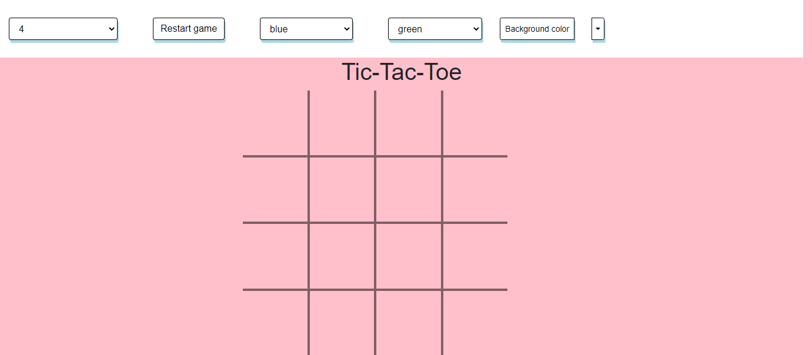
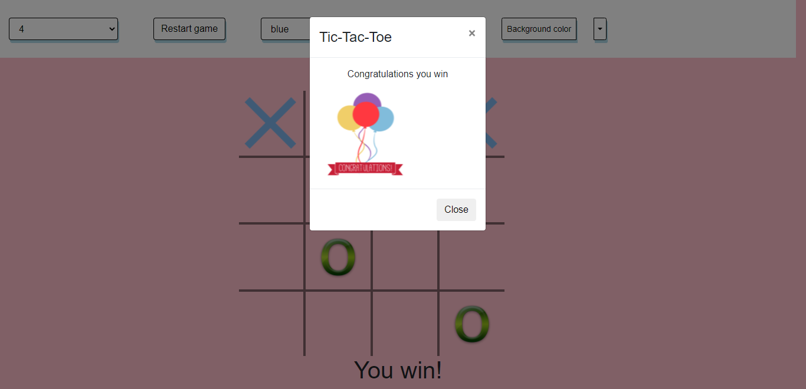
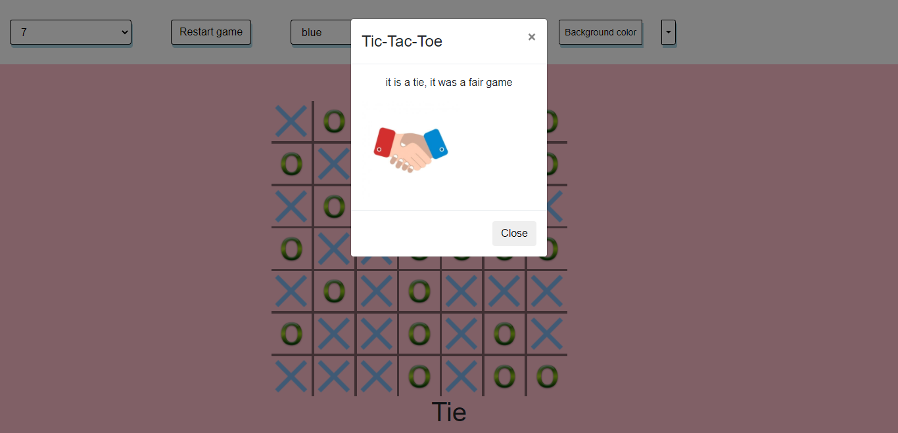

Tic-tac-toe, nougats and crosses, or Xs and Os/“X’y O’sies”, is a
paper-and-pencil game for two players, X and O, who take turns marking the
spaces in a grid. The player who succeeds in placing three of their marks in a
diagonal, horizontal, or vertical row is the winner.

The game is written in JavaScript it has 6 levels and it is between the player
and the computer the player can change the level, background color and Xes or
Oes colors.

